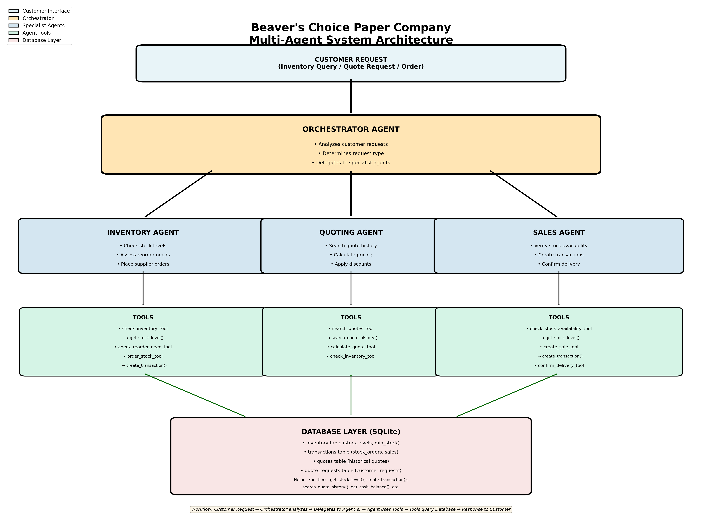

#  Beaver's Choice Paper Company - Multi-Agent System

A comprehensive multi-agent system for inventory management, quote generation, and sales processing using AI agents.

##  Project Overview

This project implements an intelligent multi-agent system to revolutionize the operations of Beaver's Choice Paper Company. The system handles customer inquiries, manages inventory levels, generates competitive quotes, and processes sales transactions through coordinated AI agents.

##  System Architecture

The system consists of **4 specialized agents**:

1. **Orchestrator Agent** - Central coordinator that routes requests
2. **Inventory Agent** - Manages stock levels and reordering
3. **Quoting Agent** - Generates competitive price quotes
4. **Sales Agent** - Finalizes transactions and order fulfillment

### Workflow Diagram

See [agent_workflow_diagram.md](agent_workflow_diagram.md) for detailed workflow description.

##  Quick Start

### Prerequisites
- Python 3.10+
- pip package manager

### Installation

`ash
# Install dependencies
pip install -r requirements.txt
pip install smolagents litellm

# Configure environment
cp .env.example .env
# Edit .env and add your UDACITY_OPENAI_API_KEY
`

### Running the System

`ash
python beaver_choice_multi_agent.py
`

The system will:
- Initialize the database
- Process sample customer requests
- Generate test_results.csv with evaluation results

##  Features

### Business Logic
- **Bulk Discounts**: 5%, 10%, 15% based on order value
- **Delivery Estimates**: 0-7 days based on quantity
- **Automatic Reordering**: When stock falls below minimum levels
- **Financial Tracking**: Real-time cash and inventory monitoring

### Agent Capabilities
- Historical quote analysis
- Intelligent pricing strategies
- Stock availability verification
- Professional customer responses

##  Technology Stack

- **Framework**: smolagents v1.23.0
- **LLM Model**: GPT-4o-mini (via Vocareum)
- **Database**: SQLite with SQLAlchemy
- **Language**: Python 3.10+

##  Project Structure

`
 beaver_choice_multi_agent.py    # Main implementation
 agent_workflow_diagram.png      # Visual workflow
 agent_workflow_diagram.md       # Workflow description
 PROJECT_REPORT.md               # Comprehensive documentation
 test_results.csv                # Evaluation results
 requirements.txt                # Dependencies
 .env.example                    # Environment template
 quote_requests_sample.csv       # Test dataset
 quotes.csv                      # Historical quotes
`

##  Documentation

- **[PROJECT_REPORT.md](PROJECT_REPORT.md)** - Complete system documentation
- **[agent_workflow_diagram.md](agent_workflow_diagram.md)** - Detailed workflow

##  Testing

The system is tested with 19 diverse customer requests covering:
- Different job types and event types
- Multiple order sizes (small, medium, large)
- Various paper products and quantities

Results are saved in test_results.csv.

##  Key Achievements

-  4 specialized agents working in coordination
-  9 tools utilizing all helper functions
-  Intelligent quote generation with discounts
-  Automated inventory management
-  Real-time financial tracking
-  Professional customer communication

##  License

This project is part of the Udacity AI Agent Development program.

##  Author

Developed as part of Udacity AI Agent Development course.
